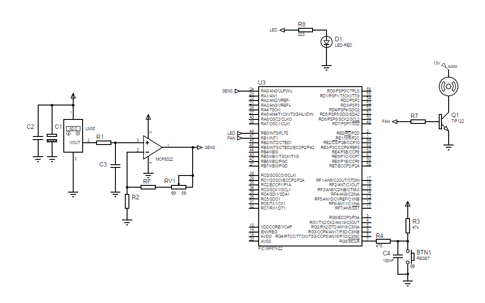

<!--- (Go to [about page](about.md) -->
# Spiegazione
		   
Il circuito serve per rilevare la temperatura in tempo reale dell’ambiente e accendere una ventola di raffreddamento quando viene raggiunta la temperatura d’intervento impostata. 
 Si prevede una temperatura d’intervento regolabile tra 25°C a 35°C.

# Schema a blocchi


## Sensore
- Come sensore di temperatura è stato scelto **LM35**
- Dato il campo di applicazione, il blocco è stato progettato per funzionare bene tra 2°C e 80°C
- I dati necessari si possono trovare nell'[allegato](Dati.md#sensore-lm35)


## Circuito di condizionamento
- Il circuito ha il compito di amplificare il segnale di uscita dal sensore e mandarlo al µC
- È prevista la possibilità di effettuare una taratura
- I relativi dati si trovano nell'[allegato](Dati.md#circuito-di-condizionamento)


## Micro controllore e display
- Il µC si occupa di acquisire i dati dal circuito di condizionamento, elaborarli e controllare opportunamente la ventola
- Viene interfacciato inoltre con un display per permettere all'utilizzatore di conoscere la temperatura rilevata e lo stato della ventola
- Per l'acquisizione dei dati viene usato l'**ADC** interno
- Ulteriori dati sono nell'[allegato](Dati.md#micro-controllore-e-display)

## Attuatore e ventola
- Il compito dell'attuatore è interfacciare il µC con la ventola
- È stato scelto per questo il BJT **TIP122**
- Le specifiche del transistor e della ventola si possono trovare nell'[allegato](Dati.md#attuatore-e-ventola)

# Schema elettrico

# Codice
## Spiegazione
Il µC deve:
- Leggere la temperatura e salvare il dato
- Controllare se la temperatura attuale è superiore alla soglia
	- Se sì accendere la ventola 
	- altrimenti spegnere la ventola 
- Aggiornare il display con la temperatura attuale e lo stato della ventola


## Diagramma di flusso


## Codice in C
```c
#include <pic18F26K22_SSD1306.h>
#include <Global.c>      // vengono definite delle macro e delle funzioni di sistema
#include <setUpDisplay.c>// procedure di inizializzazione del display
#include <Utility.c>     // funzini di stampa su display

void main(){
  setup_adc_ports(sAN0|sAN1);
  setup_adc(ADC_CLOCK_INTERNAL|ADC_TAD_MUL_0);
  
  
  //aggiungi le tue variabili
   int8 datoTemp;         // variabile dove viene salvato il valore convertito dall'ADC
   int8 datoSoglia=SOGLIA;// variabile dove viene salvato la soglia 80=>25°C
   float te=0;            // valore della temperatura ambiente
   int1 statoVentolaAttuale = STATO_VENTOLA_OFF; // variabile dove viene salvato lo stato attuale della ventola 
   int1 statoVentolaPrecedente = STATO_VENTOLA_OFF; // variabile dove viene salvato lo stato precedente della ventola
 
   displayInitialization();
   FanOff();
   blinking();
   while(TRUE) {
      datoTemp = temperatureReading();
      
      te=(float)(datoTemp)*0.31372549; // 80:255=te:datoTemp  te=datotemp*80/255  
            
      if(te > (float)datoSoglia){
         FanOn();
         statoVentolaAttuale = STATO_VENTOLA_ON;
      }else{
         FanOff();
         statoVentolaAttuale = STATO_VENTOLA_OFF;
      }
      
      aggiornaDisplay(te, datoSoglia, statoVentolaAttuale, statoVentolaPrecedente);
      
      delay_ms(1000);   // delay di 1 secondo 
      blinking();
   }
}
```

# Collaudo
È stata collaudata la board del circuito di condizionamento seguendo questo procedimento:  
- Controllo alimentazione
- Verifica funzionamento filtro RC 
- Regolazione amplificatore
- Collaudo finale con misurazione temperatura reale

Durante il collaudo del filtro RC si è verificato un problema, ovvero che i segnali oltre la frequenza di taglio non venivano attenuati.  
Per questo è stato controllato il condensatore  ed è stato scoperto che la capacità reale era molto inferiore a quella riportata.  
È stato quindi sostituito il filtro con quello che ora è montato.

